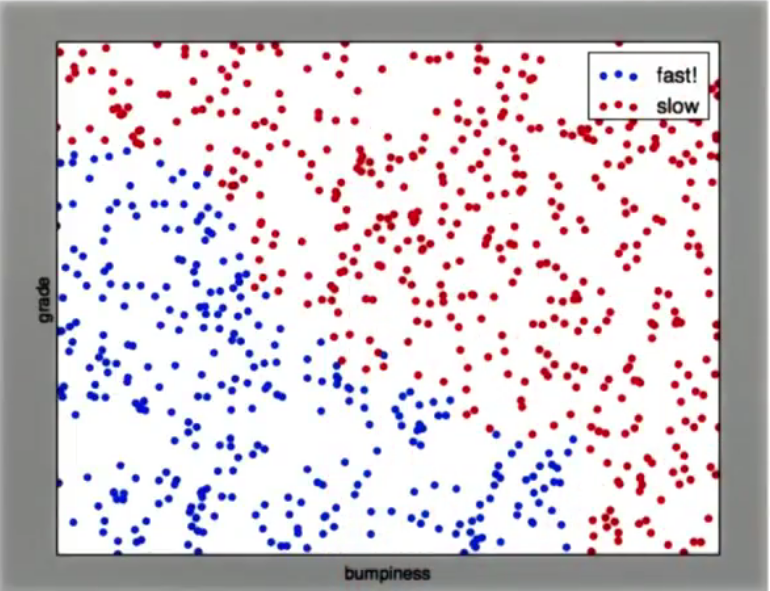

Supervised classifications: http://scikit-learn.org/stable/auto_examples/classification/plot_classifier_comparison.html

Suppose you have a scattered plot of (training) data. This chapter deals with how to predict a the output for a new input.
Example: In Stanley, we need to determine the car SPEED (high/low) based on the SLOP and the ROGHNESS of the terrain.

Three ways to cluster (separate) input data:
-- Naive Bayes (name is not indicative): Linear classifier: http://scikit-learn.org/stable/modules/generated/sklearn.naive_bayes.GaussianNB.html

-- Support Vector Machines  (name is not indicative): Linearity is overcomed by KERNELS (adding x^2, etc to features): http://scikit-learn.org/stable/modules/svm.html

-- Decision trees: Multiple linear questions: 

Pros-cons:
-- Decision trees:
---- Advantage: Easy to use, beautiful to grow (i don't understand what this means!), graphical good to understand, can build bigger classifiers (ensemble method!)
---- Disadvantage: Prone to overfitting (specially with a lot features), 

How (and where):

What are they:

Decision trees: http://scikit-learn.org/stable/modules/tree.html
code: from site:
>>> from sklearn import tree
>>> X = [[0, 0], [1, 1]]
>>> Y = [0, 1]
>>> clf = tree.DecisionTreeClassifier()
>>> clf = clf.fit(X, Y)
After being fitted, the model can then be used to predict the class of samples:
>>>
>>> clf.predict([[2., 2.]])
array([1])
Alternatively, the probability of each class can be predicted, which is the fraction of training samples of the same class in a leaf:
>>>
>>> clf.predict_proba([[2., 2.]])
array([[ 0.,  1.]])

class sklearn.tree.DecisionTreeClassifier(criterion=’gini’, splitter=’best’, max_depth=None, min_samples_split=2, min_samples_leaf=1, min_weight_fraction_leaf=0.0, max_features=None, random_state=None, max_leaf_nodes=None, min_impurity_decrease=0.0, min_impurity_split=None, class_weight=None, presort=False)

Important parameter to avoid overfitting: min_sample_split. Default is 2. i.e: for 2 sample data the tree will split.

Bias-Variance dilemma: 
-Bias: Not learning from data. Ignore the data. Not learning at all
-Variance: Other extreme: Extremelly perceptive to data. Cannot handle anything that was not trained on before.
What is need is a balance between the two.

Entropy: May be not so much needed:
- An Entropy of 1 means equal distribution. E.g.: Fliping a fair coin. For totally enfair coin (always gets a head) entropy is 0. For 25%-75%: Entropy is 0.811
https://en.wikipedia.org/wiki/Entropy_(information_theory)

- So, it's probability. But instead of looking at a single event (Head/Tail) it's looking at the overall distibution. How much do you expect the result amoung certain options? If no preference of one than the other the Entropy is 1.

- Note: The entropy is also used as an index for general wealth distribution in a country! (of course). https://en.wikipedia.org/wiki/Generalized_entropy_index
Moreover, the index today is using (Gini) index. Which is the default used decision tree as well! https://en.wikipedia.org/wiki/Gini_coefficient

- In information. it's alwas base 2.

- Infromation gain = entropy (parent) - (weighted average) entropy (children). This will decide which way to slpit.
...

- Decision tree maximizes the information gain

